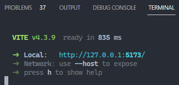
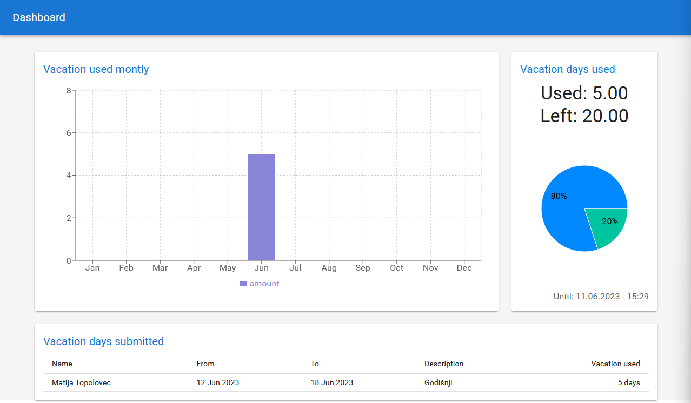

# Dashboard for Out-of-office-slackapp-bot

> Dashboard to show and visualise vacation data.

---

## Table of Contents

- [Description](#description)
- [Installation](#how-to-get-started)

---

## Description

_Dashboard for Out of office slack bot app is small app that shows the vacation data from employees data._

---

## Technologies

- React
- Typescript

[Back To The Top](#dashboard-for-out-of-office-slackapp-bot)

---

# How to get started

1. You need to have Out of office slackapp bot up and running with some data in database.
2. Download and Install node [link](https://nodejs.org/en/download 'Node js install').
3. Open the folder in Visual Studio Code [link](https://code.visualstudio.com/download 'Visual Studio Code install').
4. Open terminal inside Visual Studio Code
5. Install all dependencies using command: `npm install`
6. Turn on application using command: `npm run dev`
7. Check in your browser the link written in terminal with correct port 

9. Thats it enjoy: 

[Back To The Top](#dashboard-for-out-of-office-slackapp-bot)
